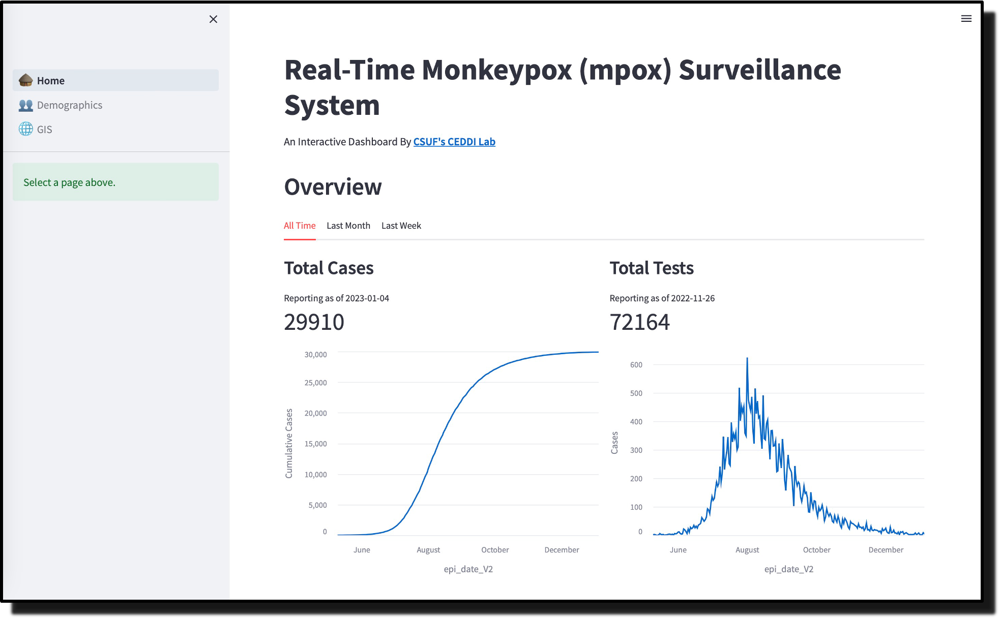
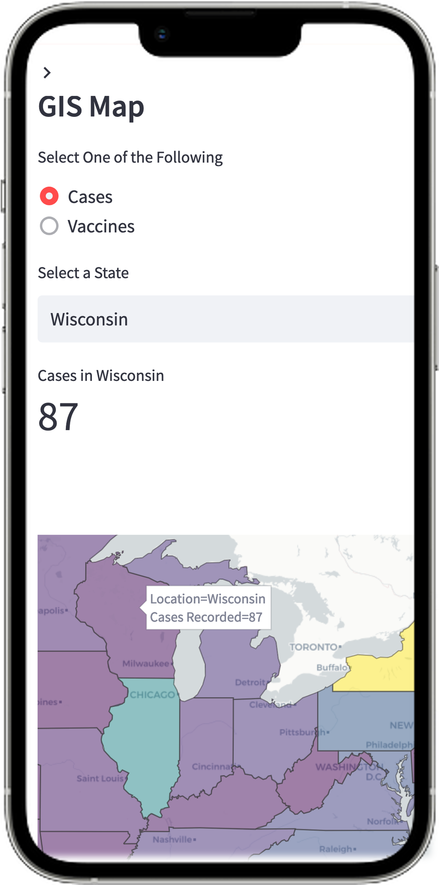
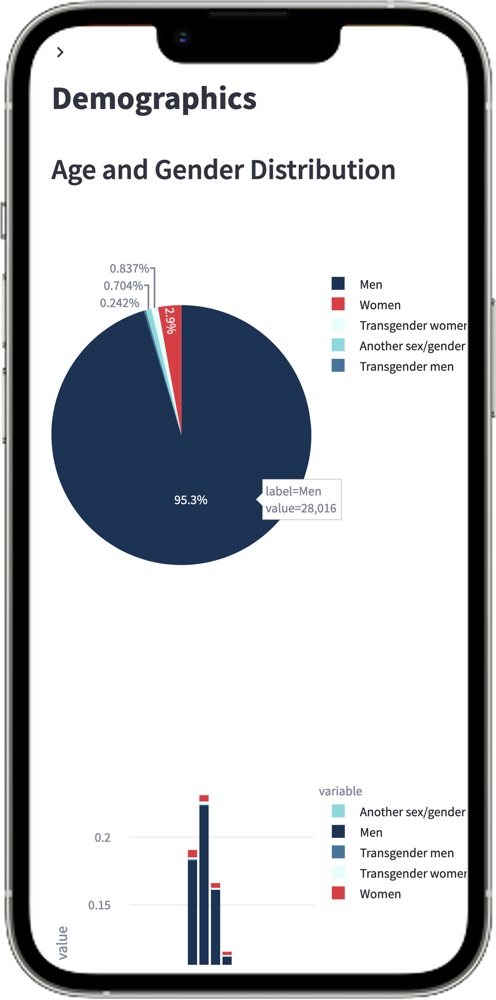

<H2 align="center"> 2022-2023 Mpox Dashboard</H2>

This project offers a *mobile-friendly*, *open-source*, *web-based* dashboard surveillance system that visualizes and identifies epidemiological patterns for any infectious disease in real-time. This dashboard is currently tracking the most recent monkeypox outbreak in the United States and can **identify the relationship between public health interventions and the fall of cases** in the US. Developed by Daniel Quezada for [CSUF's CEDDI Lab](https://www.sampsonakwafuo.com/ceddi-lab).

## Overview 📖

### Current State of Epidemiological Data Streams
- Modern telecommunications allow for public health organizations to disseminate epidemiological data
- Lower-to-middle income countries (LMICs) begin to adopt disease surveillance systems similar to high-income countries (HICs)
- Data streams have low enough latency that institutions can **publish epidemiological data in near real-time**

### Digital Syndromic Dashboards as Surveillance Tools
- Dashboard Surveillance Systems **proved to be an effective tool** to develop intervention strategies against prevalence of SARS-CoV-2
- Surveillance Systems in LMICs are typically outdated and *still rely on data from paper-based records*
- Without proper surveillance, outbreaks are more likely to spread to neighboring communities, provinces, or nations

### Human mpox
- Human monkeypox (mpox) is a zoonotic viral infetion that is extremely transmissible upon close contact, especially through sexual contact
- Most recent outbreak of 2022 represents **first time in almost twenty years that mpox has had an outbreak outside of Africa**
- Currently there are no FDA approved therapeutics or vaccines for mpox specifically

## How & What Does this Dashboard Track? 🔍

It tracks relevant epidemiological data such as:
- Total Number of Confirmed Cases
- Total Number of Vaccines Administered
- Gender Distributions of Confirmed Cases

Visualizations were created with **Plotly** & may come in the form of:
- Choropleth maps
- Bar charts 
- Line charts

   
  

